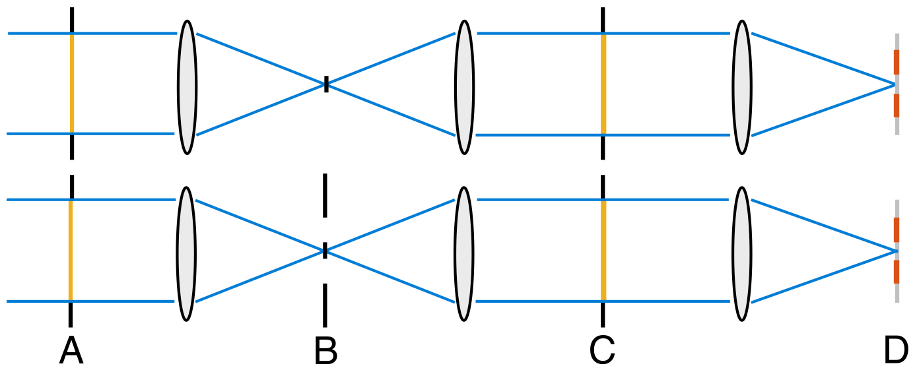
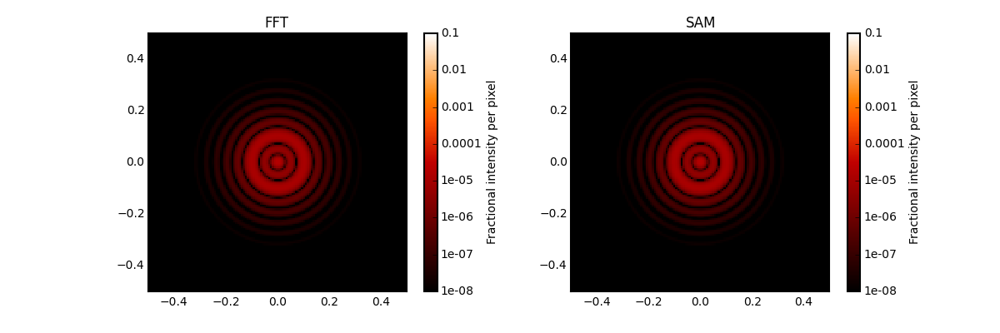
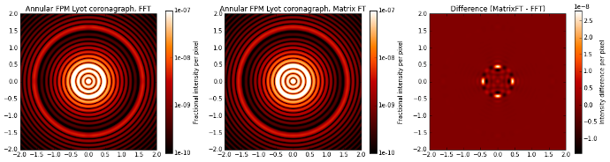
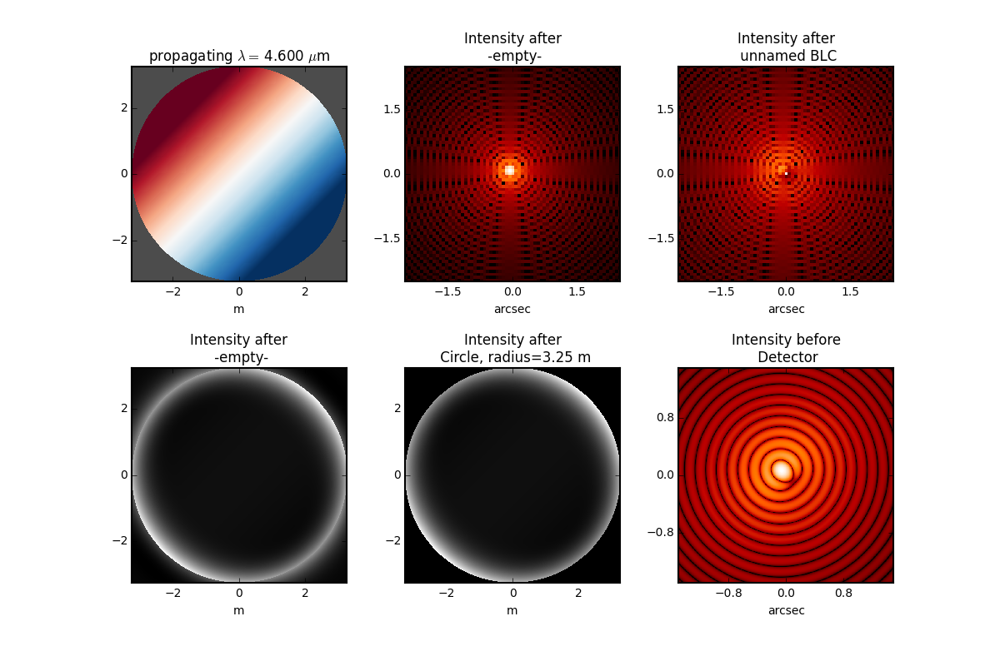
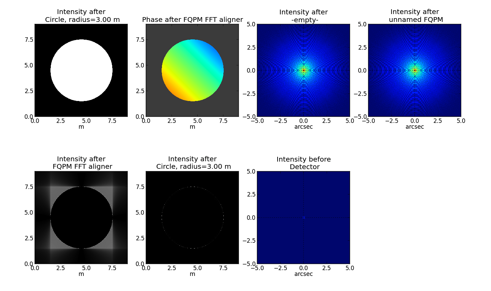
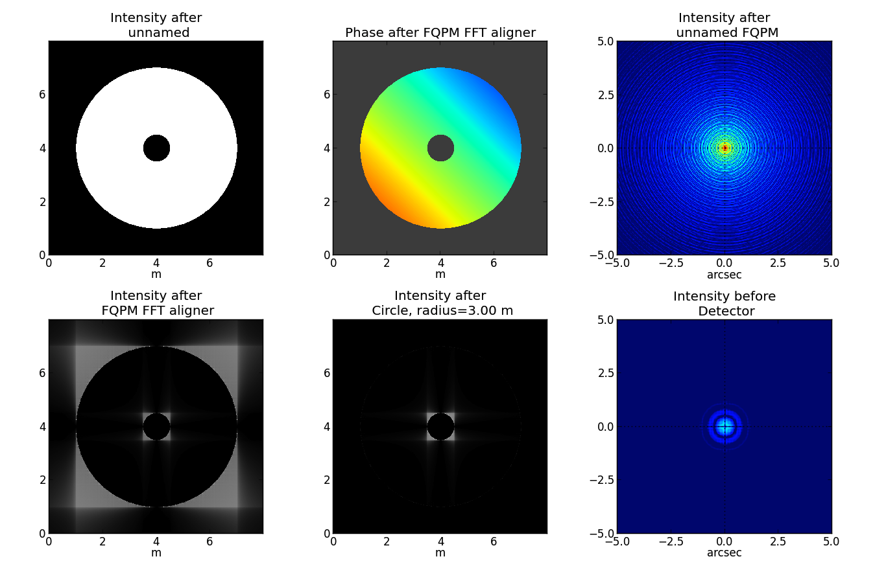

Efficient Lyot coronagraph propagation
=============================================

Poppy has extensive functionality to faciliate the modeling of coronagraph point spread functions. In addition to the general summary of those capabilities here, see the examples in the notebooks subdirectory:
`POPPY Examples <https://github.com/spacetelescope/poppy/blob/stable/notebooks/POPPY%20Examples.ipynb>`_
and
`MatrixFTCoronagraph_demo <https://github.com/spacetelescope/poppy/blob/stable/notebooks/MatrixFTCoronagraph_demo.ipynb>`_.

Introduction
--------------

By default, an optical system defined in Poppy uses the Fast Fourier Transform (FFT) to propagate the scalar field between pupil and image planes. While the FFT is a powerful tool for general Fraunhofer diffraction calculations, it is rarely the most computationally efficient approach for a coronagraph model. Consider the two coronagraph schematics below, from `Zimmerman et al (2016) <http://dx.doi.org/10.1117/1.JATIS.2.1.011012>`_:

The upper design in the figure represents the classical Lyot coronagraph and its widely implemented, optimized descendent, the `apodized pupil Lyot coronagraph (APLC) <http://dx.doi.org/10.1051/0004-6361:20021573>`_. In this case an intermediate focal plane (labeled B) is occulted by a round, opaque mask. By applying the principle of electromagnetic field superposition, combined with knowledge of how FFT complexity scales with array size, `Soummer et al. (2007) <http://dx.doi.org/10.1364/OE.15.015935>`_ showed that the number of operations needed to compute the PSF is greatly reduced by replacing the FFT with discrete Fourier transfoms, implemented in a vectorized fashion and spatially restricted to the *occulted* region of the intermediate focal plane. This is the now widely-used **semi-analytical** computational method for numerically modeling Lyot coronagraphs.

The lower design in the above figure shows a slightly different Lyot coronagraph design case. Here the focal plane mask (FPM) is a diaphragm that restricts the outer edge of the transmitted field. `Zimmerman et al. (2016) <http://dx.doi.org/10.1117/1.JATIS.2.1.011012>`_ showed how this design variant can solve the same starlight cancellation problem, in particular for the baseline design of WFIRST. With this FPM geometry, the superposition simplification of `Soummer et al. (2007) <http://dx.doi.org/10.1364/OE.15.015935>`_ is not valid. However, again the execution time is greatly reduced by using discrete, vectorized Fourier transforms, now spatially restricted to the *transmitted* region of the intermediate focal plane.

In Poppy, two subclasses of OpticalSystem exploit the computational methods described above: SemiAnalyticCoronagraph and MatrixFTCoronagraph. Let's see how to make use of these subclasses to speed up Lyot corongraph PSF calculations.

Lyot coronagraph using the SemiAnalytic subclass
---------------------------------------------------

In this example we consider a Lyot coronagraph with a conventional, opaque occulting spot. This configuration corresponds to the upper half of the schematic described above.

The semi-analytic method is specified by first creating an OpticalSystem as usual, and then casting it to a SemiAnalyticCoronagraph class (which has a special customized propagation method implementing the alternate algorithm):

The following code performs the same calculation both with semi-analytical and FFT propagation, and compares their speeds::

        radius = 6.5/2
        lyot_radius = 6.5/2.5
        pixelscale = 0.060

        osys = poppy.OpticalSystem("test", oversample=8)
        osys.add_pupil( poppy.CircularAperture(radius=radius), name='Entrance Pupil')
        osys.add_image( poppy.CircularOcculter(radius = 0.1) )
        osys.add_pupil( poppy.CircularAperture(radius=lyot_radius), name='Lyot Pupil')
        osys.add_detector(pixelscale=pixelscale, fov_arcsec=5.0)

        plt.figure(1)
        sam_osys = poppy.SemiAnalyticCoronagraph(osys, oversample=8, occulter_box=0.15)
   
        import time
        t0s = time.time()
        psf_sam = sam_osys.calc_psf(display_intermediates=True)
        t1s = time.time()

        plt.figure(2)
        t0f = time.time()
        psf_fft = osys.calc_psf(display_intermediates=True)
        t1f = time.time()

        plt.figure(3)
        plt.clf()
        plt.subplot(121)
        poppy.utils.display_psf(psf_fft, title="FFT")
        plt.subplot(122)
        poppy.utils.display_psf(psf_sam, title="SAM")

        print("Elapsed time, FFT:  %.3s" % (t1f-t0f))
        print("Elapsed time, SAM:  %.3s" % (t1s-t0s))

On a circa-2010 Mac Pro, the results are dramatic::

        Elapsed time, FFT:  62.
        Elapsed time, SAM:  4.1

Lyot coronagraph using the MatrixFTCoronagraph subclass
--------------------------------------------------------

This coronagraph uses an annular diaphragm in the intermediate focal plane, corresponding to the lower half of the diagram above.

The procedure to enable the MatrixFTCoronagraph propagation is analogous to the SemiAnalytic case. We create an OpticalSystem as usual, and then cast it to a MatrixFTCoronagraph class.

Again we will compare the execution time with the FFT case.::

        D = 2.
        wavelen = 1e-6
        ovsamp = 8
        
        # Annular diaphragm FPM, inner radius ~ 4 lam/D, outer rad ~ 16 lam/D
        fftcoron_annFPM_osys = poppy.OpticalSystem(oversample=ovsamp)
        fftcoron_annFPM_osys.add_pupil( poppy.CircularAperture(radius=D/2) )
        spot = poppy.CircularOcculter( radius=0.4  )
        diaphragm = poppy.InverseTransmission( poppy.CircularOcculter( radius=1.6 ) )
        annFPM = poppy.CompoundAnalyticOptic( opticslist = [diaphragm, spot] )
        fftcoron_annFPM_osys.add_image( annFPM )
        fftcoron_annFPM_osys.add_pupil( poppy.CircularAperture(radius=0.9*D/2) )
        fftcoron_annFPM_osys.add_detector( pixelscale=0.05, fov_arcsec=4. )
        
        # Re-cast as MFT coronagraph with annular diaphragm FPM
        matrixFTcoron_annFPM_osys = poppy.MatrixFTCoronagraph( fftcoron_annFPM_osys, occulter_box=diaphragm.uninverted_optic.radius_inner )
        t0_fft = time.time()
        annFPM_fft_psf, annFPM_fft_interm = fftcoron_annFPM_osys.calc_psf(wavelen, display_intermediates=True,\
                                                                 return_intermediates=True)
        t1_fft = time.time()
        
        plt.figure()
        t0_mft = time.time()
        annFPM_mft_psf, annFPM_mft_interm = matrixFTcoron_annFPM_osys.calc_psf(wavelen, display_intermediates=True,\
                                                                     return_intermediates=True)
        t1_mft = time.time()

Plot the results::

         plt.figure(figsize=(16,3.5))
         plt.subplots_adjust(left=0.10, right=0.95, bottom=0.02, top=0.98, wspace=0.2, hspace=None)
         plt.subplot(131)
         ax_fft, cbar_fft = poppy.display_psf(annFPM_fft_psf, vmin=1e-10, vmax=1e-7, title='Annular FPM Lyot coronagraph, FFT',
                                     return_ax=True)
         plt.subplot(132)
         poppy.display_psf(annFPM_mft_psf, vmin=1e-10, vmax=1e-7, title='Annular FPM Lyot coronagraph, Matrix FT')
         plt.subplot(133)
         diff_vmin = np.min(annFPM_mft_psf[0].data - annFPM_fft_psf[0].data)
         diff_vmax = np.max(annFPM_mft_psf[0].data - annFPM_fft_psf[0].data)
         poppy.display_psf_difference(annFPM_mft_psf, annFPM_fft_psf, vmin=diff_vmin, vmax=diff_vmax, cmap='gist_heat')
         plt.title('Difference (MatrixFT - FFT)')

Print some of the propagation parameters:: 

         lamoD_asec = wavelen/fftcoron_annFPM_osys.planes[0].pupil_diam * 180/np.pi * 3600
         print("System diffraction resolution element scale (lambda/D) in arcsec: %.3f" % lamoD_asec)
         print("Array width in first focal plane, FFT: %d" % annFPM_fft_interm[1].amplitude.shape[0])
         print("Array width in first focal plane, MatrixFT: %d" % annFPM_mft_interm[1].amplitude.shape[0])
         print("Array width in Lyot plane, FFT: %d" % annFPM_fft_interm[2].amplitude.shape[0])
         print("Array width in Lyot plane, MatrixFT: %d" % annFPM_mft_interm[2].amplitude.shape[0])

         System diffraction resolution element scale (lambda/D) in arcsec: 0.103
         Array width in first focal plane, FFT: 8192
         Array width in first focal plane, MatrixFT: 248
         Array width in Lyot plane, FFT: 8192
         Array width in Lyot plane, MatrixFT: 1024

Compare the elapsed time::

         print("Elapsed time, FFT:  %.1f s" % (t1_fft-t0_fft))
         print("Elapsed time, Matrix FT:  %.1f s" % (t1_mft-t0_mft))

         Elapsed time, FFT:  142.0 s
         Elapsed time, Matrix FT:  3.0 s

Band-limited coronagraph
-------------------------

Depending on the specific implementation, a Lyot coronagraph with a band-limited occulter can also benefit from the semi-analytical method in Poppy. For additional band-limited coronagraph examples, see the JWST NIRCam coronagraph modes included in `WebbPSF <http://github.com/spacetelescope/webbpsf>`_.

As an example of a more complicated coronagraph PSF calculation than the ones above, here's a NIRCam-style band limited coronagraph with the source not precisely centered::

    oversample=2
    pixelscale = 0.010  #arcsec/pixel
    wavelength = 4.6e-6

    osys = poppy.OpticalSystem("test", oversample=oversample)
    osys.add_pupil(poppy.CircularAperture(radius=6.5/2))
    osys.add_image()
    osys.add_image(poppy.BandLimitedCoron(kind='circular',  sigma=5.0)) 
    osys.add_pupil()
    osys.add_pupil(poppy.CircularAperture(radius=6.5/2))
    osys.add_detector(pixelscale=pixelscale, fov_arcsec=3.0)

    osys.source_offset_theta = 45.
    osys.source_offset_r =  0.1  # arcsec
    psf = osys.calc_psf(wavelength=wavelength, display_intermediates=True)
    
   

 
FQPM coronagraph
------------------

Due to the wide (ideally infinite) spatial extension of its focal plane phase-shifting optic, the four-quadrant phase mask (FQPM) coronagraphs relies on FFT propagation. Another unique complication of the FQPM coronagraph class is its array alignment requirement between the FFT result in the intermediate focal plane with the center of the phase mask. This is done using a virtual optic called an 'FQPM FFT aligner' as follows::

    optsys = poppy.OpticalSystem()
    optsys.add_pupil( poppy.CircularAperture( radius=3, pad_factor=1.5)) #pad display area by 50%
    optsys.add_pupil( poppy.FQPM_FFT_aligner())   # ensure the PSF is centered on the FQPM cross hairs
    optsys.add_image()  # empty image plane for "before the mask"
    optsys.add_image( poppy.IdealFQPM(wavelength=2e-6))
    optsys.add_pupil( poppy.FQPM_FFT_aligner(direction='backward'))  # undo the alignment tilt after going back to the pupil plane
    optsys.add_pupil( poppy.CircularAperture( radius=3)) # Lyot mask - change radius if desired
    optsys.add_detector(pixelscale=0.01, fov_arcsec=10.0)

    psf = optsys.calc_psf(wavelength=2e-6, display_intermediates=True)

FQPM on an Obscured Aperture (demonstrates compound optics)
--------------------------------------------------------------

As a variation, we can add a secondary obscuration. This can be done by
creating a compound optic consisting of the circular outer aperture plus an
opaque circular obscuration. The latter we can make using the InverseTransmission class. ::

    primary = poppy.CircularAperture( radius=3)
    secondary = poppy.InverseTransmission( poppy.CircularAperture(radius=0.5) )
    aperture = poppy.CompoundAnalyticOptic( opticslist = [primary, secondary] )

    optsys = poppy.OpticalSystem()
    optsys.add_pupil( aperture)
    optsys.add_pupil( poppy.FQPM_FFT_aligner())   # ensure the PSF is centered on the FQPM cross hairs
    optsys.add_image( poppy.IdealFQPM(wavelength=2e-6))
    optsys.add_pupil( poppy.FQPM_FFT_aligner(direction='backward'))  # undo the alignment tilt after going back to the pupil plane
    optsys.add_pupil( poppy.CircularAperture( radius=3)) # Lyot mask - change radius if desired
    optsys.add_detector(pixelscale=0.01, fov_arcsec=10.0)

    optsys.display()

    psf = optsys.calc_psf(wavelength=2e-6, display_intermediates=True)

