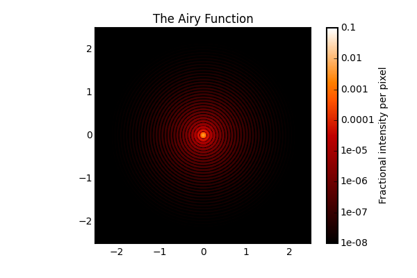
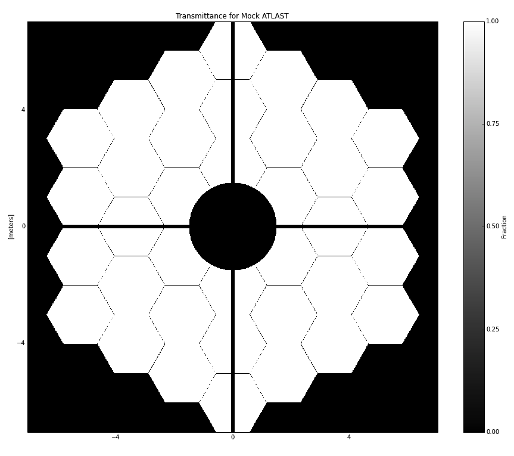
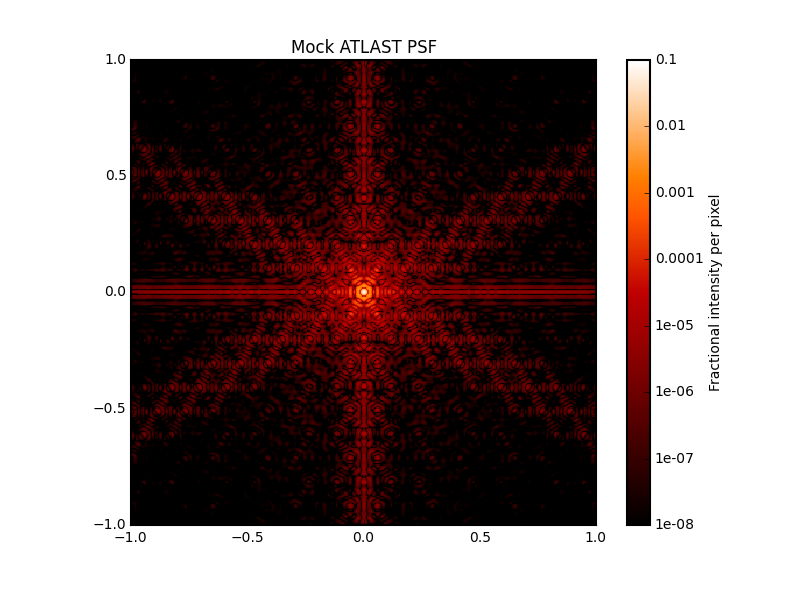
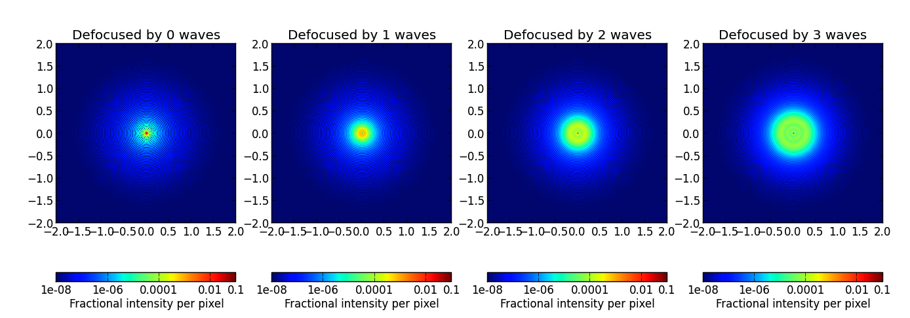
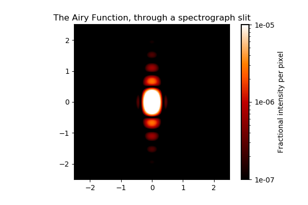
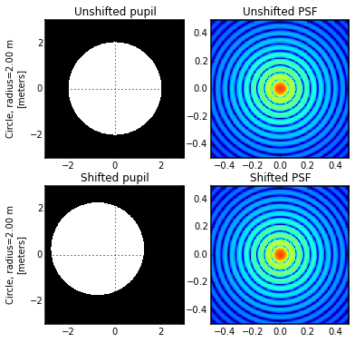
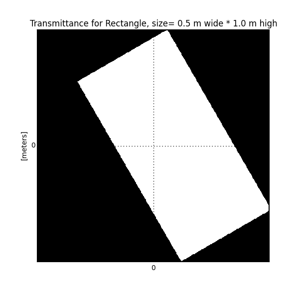
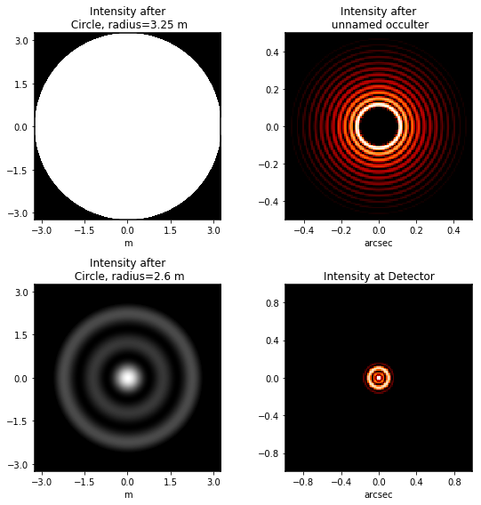

.. _examples:

Example Code and Getting Started
================================

Let's dive right in to some example code. 

(A runnable notebook version of this examples page is included in the `notebooks` subdirectory of the
``poppy`` source, or is available from `here <https://github.com/spacetelescope/poppy/blob/stable/notebooks/POPPY%20Examples.ipynb>`_.)

For all of the following examples, you will have more informative text output when running the code
if you first enable Python's logging mechanism to display log messages to screen::

        import logging
        logging.basicConfig(level=logging.DEBUG)

.. contents:: :local:

A simple circular pupil
--------------------------

This is very simple, as it should be::

        osys = poppy.OpticalSystem()
        osys.add_pupil( poppy.CircularAperture(radius=3))    # pupil radius in meters
        osys.add_detector(pixelscale=0.010, fov_arcsec=5.0)  # image plane coordinates in arcseconds

        psf = osys.calc_psf(2e-6)                            # wavelength in meters
        poppy.display_psf(psf, title='The Airy Function')

A complex segmented pupil
--------------------------

By combining multiple analytic optics together it is possible to create quite complex pupils::

        ap = poppy.MultiHexagonAperture(rings=3, flattoflat=2)           # 3 rings of 2 m segments yields 14.1 m circumscribed diameter
        sec = poppy.SecondaryObscuration(secondary_radius=1.5, n_supports=4, support_width=0.1)   # secondary with spiders
        atlast = poppy.CompoundAnalyticOptic( opticslist=[ap, sec], name='Mock ATLAST')           # combine into one optic

        atlast.display(npix=1024, colorbar_orientation='vertical')

And here's the PSF::

        osys = poppy.OpticalSystem()
        osys.add_pupil(atlast)
        osys.add_detector(pixelscale=0.010, fov_arcsec=2.0)
        psf = osys.calc_psf(1e-6)

        poppy.display_psf(psf, title="Mock ATLAST PSF")

Multiple defocused PSFs
---------------------------

Defocus can be added using a lens::

        wavelen=1e-6
        nsteps = 4
        psfs = []
        for nwaves in range(nsteps):

            osys = poppy.OpticalSystem("test", oversample=2)
            osys.add_pupil( poppy.CircularAperture(radius=3))    # pupil radius in meters
            osys.add_pupil( poppy.ThinLens(nwaves=nwaves, reference_wavelength=wavelen, radius=3))
            osys.add_detector(pixelscale=0.01, fov_arcsec=4.0)

            psf = osys.calc_psf(wavelength=wavelen)
            psfs.append(psf)

            plt.subplot(1,nsteps, nwaves+1)
            poppy.display_psf(psf, title='Defocused by {0} waves'.format(nwaves),
                colorbar_orientation='horizontal')

        

Specifying Quantities with Units
--------------------------------

Poppy makes use of the `astropy.units <https://docs.astropy.org/en/stable/units/>`_ framework, and many input parameters can be specified as quantities with units. ::

    import astropy.units as u

    psf = osys.calc_psf(wavelength=2e-6)     # bare numbers without units are interpreted by default as meters for lengths
    psf = osys.calc_psf(wavelength=2*u.micron)
    psf = osys.calc_psf(wavelength=2000*u.nm)     # These are all equivalent ways to specify the same wavelength

Variables with angular dimensions for image plane elements can be specified as arcseconds by default, or other angular units if so desired ::

    slit = poppy.RectangularFieldStop(width=0.5*u.arcsec, height=60*u.arcsec)    # Slit for a long slit spectrograph
    slit = poppy.RectangularFieldStop(width=0.5, height=60)                      # bare numbers without units are interpreted as arcsec in this case
    slit = poppy.RectangularFieldStop(width=2.4*u.urad, height=1*u.arcmin)       # This works too; mix units and conversions are handled automatically

Image plane detector pixel scales should be specified in units of `u.arcsec/u.pixel` or equivalent angular-per-pixel units. (In :ref:`fresnel` models, discussed later, detectors should be specified with physical pixel scales in `u.micron/u.pixel` or equivalent) ::

    det = poppy.Detector(fov_pixels=1024, pixelscale=0.1*u.arcsec/u.pixel)

Spectrograph Slit
-----------------

Let's model diffraction through a slit, as could be used to compute slit losses for instance.
This example shows the use of astropy units and quantities for specifying input parameters::

    osys = poppy.OpticalSystem()
    osys.add_pupil(poppy.CircularAperture(radius=0.5*u.meter))
    osys.add_image(poppy.RectangularFieldStop(width=0.5*u.arcsec, height=10*u.arcsec) )
    osys.add_pupil(poppy.CircularAperture(radius=1*u.meter))   # reimaged pupil in spectrograph; typically would have a grating here
    osys.add_detector(pixelscale=0.010*u.arcsec/u.pixel, fov_arcsec=5.0)

    psf = osys.calc_psf(wavelength=2e-6)

    poppy.display_psf(psf, title='The Airy Function, through a spectrograph slit', vmax=1e-5, )

Band Limited Coronagraph with Off-Axis Source
-----------------------------------------------

As an example of a more complicated calculation, here's a NIRCam-style band limited coronagraph with the source not precisely centered::

    oversample=2
    pixelscale = 0.010  #arcsec/pixel
    wavelength = 4.6e-6

    osys = poppy.OpticalSystem("test", oversample=oversample)
    osys.add_pupil(poppy.CircularAperture(radius=6.5/2))
    osys.add_image()
    osys.add_image(poppy.BandLimitedCoron(kind='circular',  sigma=5.0)) 
    osys.add_pupil()
    osys.add_pupil(poppy.CircularAperture(radius=6.5/2))
    osys.add_detector(pixelscale=pixelscale, fov_arcsec=3.0)

    osys.source_offset_theta = 45.
    osys.source_offset_r =  0.1  # arcsec
    psf = osys.calc_psf(wavelength=wavelength, display_intermediates=True)

.. image:: ./example_BLC_offset.png
   :scale: 60%
   :align: center
   :alt: Sample calculation result

FQPM coronagraph
------------------

Four quadrant phase mask coronagraphs are a bit more complicated because one needs to ensure proper alignment of the
FFT result with the center of the phase mask. This is done using a virtual optic called an 'FQPM FFT aligner' as follows::

    optsys = poppy.OpticalSystem()
    optsys.add_pupil( poppy.CircularAperture( radius=3, pad_factor=1.5)) #pad display area by 50%
    optsys.add_pupil( poppy.FQPM_FFT_aligner())   # ensure the PSF is centered on the FQPM cross hairs
    optsys.add_image()  # empty image plane for "before the mask"
    optsys.add_image( poppy.IdealFQPM(wavelength=2e-6))
    optsys.add_pupil( poppy.FQPM_FFT_aligner(direction='backward'))  # undo the alignment tilt after going back to the pupil plane
    optsys.add_pupil( poppy.CircularAperture( radius=3)) # Lyot mask - change radius if desired
    optsys.add_detector(pixelscale=0.01, fov_arcsec=10.0)

    psf = optsys.calc_psf(wavelength=2e-6, display_intermediates=True)

.. image:: ./example_FQPM.png
   :scale: 60%
   :align: center
   :alt: Sample calculation result

FQPM on an Obscured Aperture (demonstrates compound optics)
--------------------------------------------------------------

As a variation, we can add a secondary obscuration. This can be done by
creating a compound optic consisting of the circular outer aperture plus an
opaque circular obscuration. The latter we can make using the InverseTransmission class. ::

    primary = poppy.CircularAperture( radius=3)
    secondary = poppy.InverseTransmission( poppy.CircularAperture(radius=0.5) )
    aperture = poppy.CompoundAnalyticOptic( opticslist = [primary, secondary] )

    optsys = poppy.OpticalSystem()
    optsys.add_pupil( aperture)
    optsys.add_pupil( poppy.FQPM_FFT_aligner())   # ensure the PSF is centered on the FQPM cross hairs
    optsys.add_image( poppy.IdealFQPM(wavelength=2e-6))
    optsys.add_pupil( poppy.FQPM_FFT_aligner(direction='backward'))  # undo the alignment tilt after going back to the pupil plane
    optsys.add_pupil( poppy.CircularAperture( radius=3)) # Lyot mask - change radius if desired
    optsys.add_detector(pixelscale=0.01, fov_arcsec=10.0)

    optsys.display()

    psf = optsys.calc_psf(wavelength=2e-6, display_intermediates=True)

.. image:: ./example_FQPM_obscured.png
   :scale: 60%
   :align: center
   :alt: Sample calculation result

Semi-analytic Coronagraph Calculations
----------------------------------------

In some cases, coronagraphy calculations can be sped up significantly using the semi-analytic algorithm of Soummer et al. 
This is implemented by first creating an OpticalSystem as usual, and then casting it to a SemiAnalyticCoronagraph class 
(which has a special customized propagation method implementing the alternate algorithm):

The following code performs the same calculation both ways and compares their speeds::

        radius = 6.5/2
        lyot_radius = 6.5/2.5
        pixelscale = 0.060

        osys = poppy.OpticalSystem("test", oversample=8)
        osys.add_pupil( poppy.CircularAperture(radius=radius), name='Entrance Pupil')
        osys.add_image( poppy.CircularOcculter(radius = 0.1) )
        osys.add_pupil( poppy.CircularAperture(radius=lyot_radius), name='Lyot Pupil')
        osys.add_detector(pixelscale=pixelscale, fov_arcsec=5.0)

        plt.figure(1)
        sam_osys = poppy.SemiAnalyticCoronagraph(osys, oversample=8, occulter_box=0.15)

        import time
        t0s = time.time()
        psf_sam = sam_osys.calc_psf(display_intermediates=True)
        t1s = time.time()

        plt.figure(2)
        t0f = time.time()
        psf_fft = osys.calc_psf(display_intermediates=True)
        t1f = time.time()

        plt.figure(3)
        plt.clf()
        plt.subplot(121)
        poppy.utils.display_psf(psf_fft, title="FFT")
        plt.subplot(122)
        poppy.utils.display_psf(psf_sam, title="SAM")

        print "Elapsed time, FFT:  %.3s" % (t1f-t0f)
        print "Elapsed time, SAM:  %.3s" % (t1s-t0s)

.. image:: ./example_SAM_comparison.png
   :scale: 50%
   :align: center
   :alt: Sample calculation result

On my circa-2010 Mac Pro, the results are dramatic::

        Elapsed time, FFT:  62.
        Elapsed time, SAM:  4.1

Shifting and rotating optics
---------------------------------

All OpticalElements support arbitrary shifts and rotations
of the optic. Set the `shift_x`, `shift_y` or `rotation` attributes. 
The shifts are given in meters for pupil plane optics, or arcseconds
for image plane optics.  Rotations are given in degrees counterclockwise around the optical
axis.

As an example, we can demonstrate the invariance of PSFs when an aperture is shifted::

    ap_regular = poppy.CircularAperture(radius=2, pad_factor=1.5)  # pad_factor is important here - without it you will
    ap_shifted = poppy.CircularAperture(radius=2, pad_factor=1.5)  # crop off part of the circle outside the array.
    ap_shifted.shift_x =-0.75
    ap_shifted.shift_y = 0.25

    plt.figure(figsize=(6,6))

    for optic, title, i in [(ap_regular, 'Unshifted', 1), (ap_shifted, 'Shifted', 3)]:

        sys = poppy.OpticalSystem()
        sys.add_pupil(optic)
        sys.add_detector(0.010, fov_pixels=100)
        psf = sys.calc_psf()

        ax1 = plt.subplot(2,2,i)
        optic.display(nrows=2, colorbar=False, ax=ax1)
        ax1.set_title(title+' pupil')
        ax2 = plt.subplot(2,2,i+1)
        poppy.display_psf(psf,ax=ax2, colorbar=False)
        ax2.set_title(title+' PSF')

In addition to setting the attributes as shown in the above example, these
options can be set directly in the initialization of such elements::

    ap = poppy.RectangleAperture(rotation=30, shift_x=0.1)
    ap.display(colorbar=False)

Adjusting Display of Intermediate Wavefronts
----------------------------------------------

When calculating a wavefront, you can display each intermediate wavefront plane, which often helps to visualize what's happening in a given propagation calculation. This is done by setting `display_intermediates=True`::

        psf = osys.calc_psf(display_intermediates=True)

Poppy attempts to guess reasonable defaults for displaying each intermediate planes, but sometimes you may wish to override these defaults. This can be done by setting
"display hint" attributes on the planes of your optical system. Available options include

 * `wavefront_display_hint` = `"intensity"` or `"phase"` to set what kind of display is shown for the complex wavefront at that plane
 * `wavefront_display_vmax_hint` and `wavefront_display_vmin_hint` to adjust the parameters of the display scale
 * `wavefront_display_imagecrop` to adjust the cropping or zoom of how much of a wavefront is displayed (by default, 
   pupil planes are not cropped, while image planes are cropped to 5 arcseconds to better show the details of the inner core region of a PSF).
 * `display_annotate` can be set to an arbitrary function to be called in order to apply custom annotations, or any other plot adjustment outside of the scope of
   the above display hints.

For instance, here's a variation of the above coronagraph calculation with some of the display parameters adjusted::

    radius = 6.5/2 * u.m
    lyot_radius = 6.5/2.5 *u.m
    pixelscale = 0.060 *u.arcsec/u.pixel
    osys = poppy.OpticalSystem(oversample=4)
    pupil = poppy.CircularAperture(radius=radius)

    occulter = poppy.CircularOcculter(radius = 0.1*u.arcsec)
    # adjust display size and color scale after the occulter
    occulter.wavefront_display_imagecrop = 1.0
    occulter.wavefront_display_vmin_hint=1e-6

    lyotstop = poppy.CircularAperture(radius=lyot_radius)
    # hint that we would like to see intensity rather than phase after Lyot stop
    lyotstop.wavefront_display_hint='intensity'

    osys.add_pupil( pupil)
    osys.add_image( occulter)
    osys.add_pupil( lyotstop)
    osys.add_detector(pixelscale=pixelscale, fov_arcsec=2.0)
    # you can also set hints onto optics in the planes list
    osys.planes[-1].wavefront_display_vmin_hint =  1e-6   

    plt.figure(figsize=(8,8))
    psf = osys.calc_psf(wavelength = 1*u.micron, display_intermediates=True)

