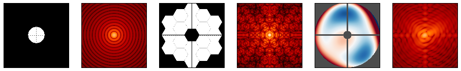

.. _poppy_home:

Documentation for POPPY
=========================

POPPY (Physical Optics Propagation in PYthon) simulates physical optical
propagation including diffraction.  It implements a flexible framework for
modeling Fraunhofer and Fresnel diffraction and point
spread function formation, particularly in the context of astronomical
telescopes.  POPPY was developed as part of a simulation package for `JWST
<http://www.stsci.edu/jwst>`_, but is broadly applicable to many kinds of
imaging simulations. 

Summary
------------

**What this software does:**

* Allows users to define an optical system consisting of multiple planes, such as pupils and images.
* Provides flexible and extensible optical element classes, including a wide variety of stops, masks, lenses and more.
* Propagates wavefronts between planes using either the :ref:`Fraunhofer <fraunhofer>` or :ref:`Fresnel <fresnel>` approximations of scalar electromagnetic theory.
* Computes monochromatic and polychromatic point spread functions through those optics.
* Provides an extensible framework for defining models of optical instruments, including
  selection of broad- and narrow-band filters, selectable optical components such as pupil stops, models of 
  optical aberrations defined by Zernike polynomials, etc.

That said, Poppy does not implement full Rayleigh-Sommerfeld electromagnetic propagation, vector electromagnetic field propagation 
such as would be needed for modeling polarization effects, nor modelling of any kind of detector noise or imperfections. 

**Getting Started:**

See `Example Code and Getting Started <https://poppy-optics.readthedocs.io/en/latest/examples.html>`_

.. admonition:: Quickstart IPython Notebook

       This documentation is complemented by an `IPython Notebook quickstart tutorial <http://nbviewer.ipython.org/github/spacetelescope/poppy/blob/stable/notebooks/POPPY_tutorial.ipynb>`_.

       Downloading and running that notebook is a great way to get started using POPPY. The documentation following here provides greater details on the algorithms and API.

:ref:`What's New in the latest version? <whatsnew>`
       

Contents
-----------

.. toctree::
  :maxdepth: 1

  installation.rst
  relnotes.rst
  overview.rst
  examples.rst
  available_optics.ipynb
  wfe.rst
  sign_conventions_for_coordinates_and_phase.ipynb
  coronagraphs.rst
  fresnel.rst
  options.rst
  extending.rst
  classes.rst
  api.rst
  about.rst
  performance.rst
  fft_optimization.rst
  dev_notes.rst

Getting Help
-------------------
POPPY is developed and maintained by :ref:`Marshall Perrin and collaborators <about_team>`. Questions, comments, and
pull requests always welcome, either via the `Github repository <https://github.com/spacetelescope/poppy>`_ or email to help@stsci.edu.

