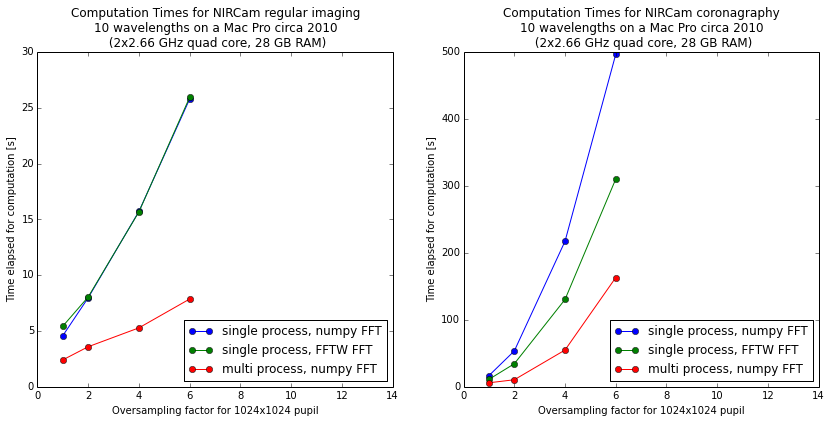

.. _performance_and_parallelization:

Appendix A: Optimizing Performance and Parallelization
=======================================================

Performance optimization on modern multi-core machines is a complex subject.

.. note::

   TL, DR: You probably want to have `a version of numpy using Intel MKL, such as the one in Anaconda <https://docs.anaconda.com/mkl-optimizations/index.html>`_,
   plus the Intel `mkl_fft <https://anaconda.org/intel/mkl_fft>`_ library, plus `numexpr <https://github.com/pydata/numexpr>`_.

Know your Linear Algebra Library
------------------------------------

The optical propagation calculations in POPPY are dominated by numerical implementations of:
 * Fourier transforms, either as Fast Fourier Transforms (mostly in Fresnel propagation) or as Matrix Fourier Transforms (mostly in Fraunhofer propagation)
 * a small number of matrix algebra calls, primarily ``np.dot`` with a side order of ``np.outer``.
 * Miscellaneous array operations, such as rasterizing optical shapes such as circular apertures into discrete arrays.

Whether or not ``numpy`` is linked against an optimized
linear algebra library can make a **huge** difference in execution speed, with
speedups of an **order of magnitude or more**. You definitely want to make sure
that your numpy is using such a library. This is generally the case if you install
your Python setup via Conda.

As of 2021, Intel's Math Kernel Library (MKL) provides the best performance for
both linear algebra and FFTs, on Intel CPUs. Installing an Intel MKL build of numpy
and the MKL FFT library are highly recommended.  If MKL is not available for your system, OpenBLAS
is also highly performant usually.

Optimal numerical implementations have changed over time. These recommendations may be out of date.
We recommend benchmarking tests on your own system for the utmost in performance.

 * Apple's `Accelerate framework
   <https://developer.apple.com/library/mac/documentation/Accelerate/Reference/AccelerateFWRef/index.html>`_
   (a.k.a. vecLib) provides a highly tuned copy of BLAS and LAPACK on any Mac,
   right out of the box.
 * `OpenBLAS <http://www.openblas.net>`_  is recommended on Linux.
 * `The Intel Math Kernel Library (MKL) Optimizations
   <https://store.continuum.io/cshop/mkl-optimizations/>`_ is available as an
   add-on from Continuum Analytics to their Anaconda Python distribution. This
   requires a commercial license for a small fee. 

Parallelized Calculations
-------------------------

POPPY can parallelize calculations in several different ways:

  1. Relying on multithreaded implementations of low-level functions in numpy to thread
     individual array operations across multiple cores.  This also includes the use
     of FFT libraries (FFTW, MKL FFT) that multithread.
  2. Using Python's ``multiprocessing`` package to launch many additional Python
     processes, each of which calculates a different wavelength.

It used to be the case that the second approach was recommended for more performance; however, as
numerical libraries have matured the added complexity (and startup overhead) of multi-process
calculations is not beneficial in most cases.

**For most users, the recommended choice is running single-process calculations and relying on numpy and MKL or FFTW to multithread calculations.** This is the default behavior.

Using multiprocessing
^^^^^^^^^^^^^^^^^^^^^^

Most users should not need this; but we document these options for flexibility.

The configuration options to enable multiprocessing live under :py:obj:`poppy.conf`, and use the Astropy configuration framework. Enable them as follows::

   >>> import poppy
   >>> poppy.conf.use_multiprocessing = True
   >>> poppy.conf.use_fftw = False

One caveat with running multiple processes is that the memory demands can become substantial for large oversampling factors.  For instance, a 1024-pixel-across pupil with ``oversampling=4`` results in arrays that are 256 MB each. Several such arrays are needed in memory per calculation, with peak memory utilization reaching ~ 1 GB per process for ``oversampling=4`` and over 4 GB per process for ``oversamping=8``.

Thus, if running on a 16-core computer, ensure at least 32 GB of RAM are available before using one process per core. If you are constrained by the amount of RAM available, you may experience better performance using fewer processes than the number of processor cores in your computer.

By default, POPPY attempts to automatically choose a number of processes based on available CPUs and free memory that will optimize computation speed without exhausting available RAM. This is implemented in the function :py:func:`poppy.utils.estimate_optimal_nprocesses`.

If desired, the number of processes can be explicitly specified::

  >>> poppy.conf.n_processes = 5

Set this to zero to enable automatic selection via the :py:func:`~poppy.utils.estimate_optimal_nprocesses` function.

Comparison of Different Parallelization Methods
^^^^^^^^^^^^^^^^^^^^^^^^^^^^^^^^^^^^^^^^^^^^^^^^

*This section is outdated; the following benchmark is from 2015.*

The following figure shows the comparison of single-process, single-process with FFTW, and multi-process calculations on a relatively high end 16-core Mac Pro. The calculations were done with WebbPSF, a PSF simulator for JWST that uses POPPY to perform computations.

The horizontal axis shows increasing detail of calculation via higher oversampling, while the vertical axis shows computation time. Note the very different
Y-axis scales for the two figures; coronagraphic calculations take much longer than direct imaging!

Using multiple Python processes is the clear winner for most workloads. Explore the options to find what works best for your particular calculations and computer setup.

Fourier Transform Benchmarks with Different Accelerated Math Libraries
------------------------------------------------------------------------

There are benchmarking functions in `poppy.accel_math` for measuring propagation transform speed versus

