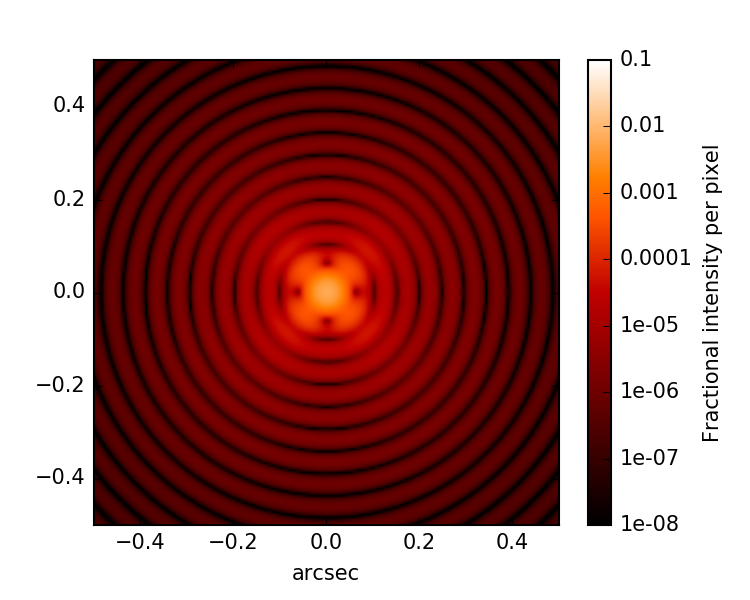
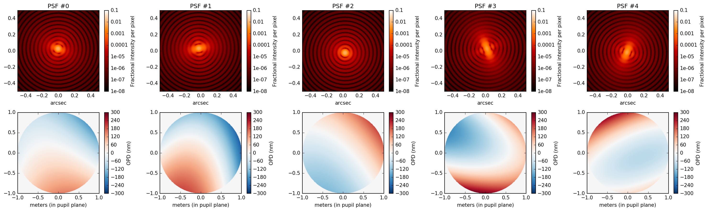
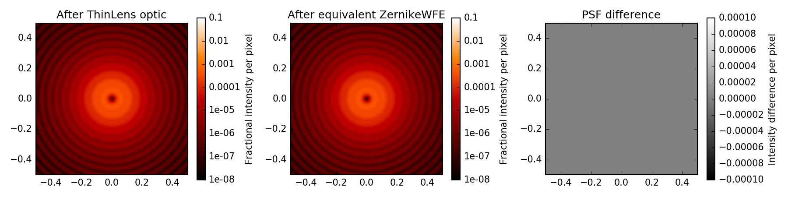
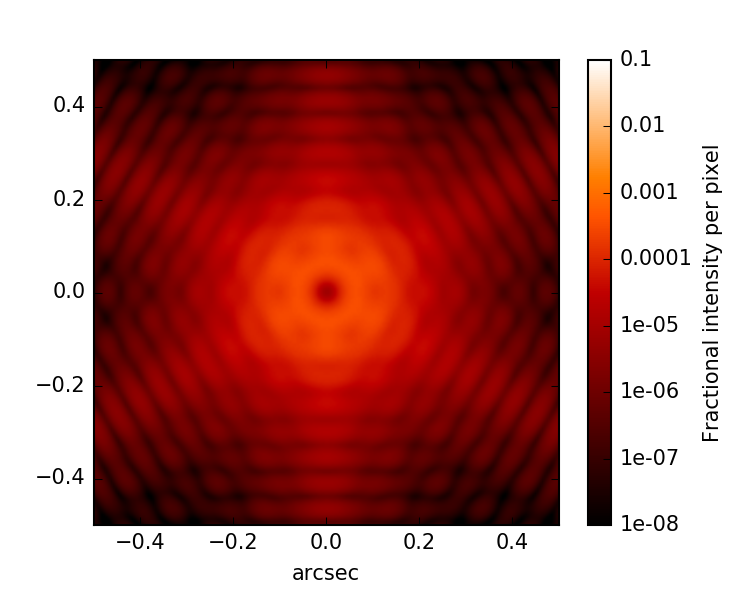

.. _wfe:

Representing sources of wavefront error
=======================================

POPPY allows you to introduce wavefront error at any plane in an optical system through use of a wavefront error optical element. For Fraunhofer-domain propagation, the optical element types discussed here will act as pupil-conjugate planes. Currently, there is the `~poppy.ZernikeWFE` optical element to represent wavefront error as a combination of Zernike terms, and the `~poppy.ParameterizedWFE` optical element that offers the ability to specify basis sets other than Zernikes. Several such :ref:`basis functions <basis_functions>` are provided, along with tools for composing and decomposing wavefront errors using these bases. There is also a `~poppy.SineWaveWFE` element that lets you represent a simple sinusoidal phase ripple.

ZernikeWFE
----------

The `~poppy.ZernikeWFE` analytic optical element provides a way to introduce wavefront error as a combination of Zernike terms. The Zernike terms are both ordered in and normalized in the convention of Noll 1976. [#noll1976]_ This means that the polynomial terms carry a normalization factor to make :math:`\int_0^{2\pi} \int_0^1 Z_j^2\,\rho\,d\rho\,d\theta = \pi.` Additionally, the standard deviation of the optical path difference over the disk for any given term will be 1.0 meters.

Now, 1.0 meters is a lot of OPD, so coefficients supplied to ZernikeWFE for realistic situations will typically be on the order of the wavelength of light being passed through the system. For example, for 100 nanometers RMS wavefront error in a particular term, the coefficient would be 100e-9 *meters*. (For information on representing certain values of peak-to-valley wavefront error, see :ref:`zernike_normalization`.)

To construct a ZernikeWFE optical element, the following keyword arguments are used:

 * ``coefficients`` -- A sequence of coefficients in the 1-D ordering of Noll 1976. Note that the first element in Noll's indexing convention is :math:`j = 1`, but Python indices are numbered from 0, so ``coefficients[0]`` corresponds to the coefficient for :math:`j = 1`.
 * ``radius`` -- The radius in meters (in the pupil plane) which the Zernike unit disk covers. Transmission beyond this radius is cut off, just as with a circular aperture of the same radius, so choose one large enough to enclose the entire pupil area.

Here's an example that creates a ZernikeWFE optic to apply zero piston, 30 nm RMS of "tip", and 200 nm RMS of "tilt" to an optical system with a 2 meter diameter pupil. ::

   wfe = poppy.ZernikeWFE(radius=1.0, coefficients=[0, 3e-8, 2e-7])

The ``wfe`` optic can then be added to the OpticalSystem as usual. Next we'll look at some examples of using ZernikeWFE with their output.

The examples that follow make use of the following common constants::

   RADIUS = 1.0 # meters
   WAVELENGTH = 460e-9 # meters
   PIXSCALE = 0.01 # arcsec / pix
   FOV = 1 # arcsec
   NWAVES = 1.0

.. _zernikewfe_astigmatism:

Using ZernikeWFE to introduce astigmatism in a PSF
^^^^^^^^^^^^^^^^^^^^^^^^^^^^^^^^^^^^^^^^^^^^^^^^^^

Per the 1-D indexing convention in Noll 1976, oblique astigmatism is :math:`j = 5` and vertical astigmatism is :math:`j = 6`. For a contribution of 35 nm RMS from oblique astigmatism, the coefficients sequence looks like ``[0, 0, 0, 0, 35e-9]``.

::

   coefficients_sequence = [0, 0, 0, 0, 35e-9]

   osys = poppy.OpticalSystem()
   circular_aperture = poppy.CircularAperture(radius=RADIUS)
   osys.add_pupil(circular_aperture)
   thinlens = poppy.ZernikeWFE(radius=RADIUS, coefficients=coefficients_sequence)
   osys.add_pupil(thinlens)
   osys.add_detector(pixelscale=PIXSCALE, fov_arcsec=FOV)

   psf_with_zernikewfe = osys.calc_psf(wavelength=WAVELENGTH, display_intermediates=True)

The resulting PSF and OPD map:

   PSF of a 2.0 meter diameter circular aperture with oblique astigmatism applied.

Using ZernikeWFE to analyze a variety of possible PSFs given a WFE budget
^^^^^^^^^^^^^^^^^^^^^^^^^^^^^^^^^^^^^^^^^^^^^^^^^^^^^^^^^^^^^^^^^^^^^^^^^

The API for `ZernikeWFE` also lends itself well to generating coefficients programmatically and passing it in. Say we have an error budget where we know the following about the RMS wavefront error in the Zernike components:

  * **Piston**, *j=1* — disregarded for a telescope
  * **Tilt X**, *j=2* — ±100 nm RMS
  * **Tilt Y**, *j=3* — ±100 nm RMS
  * **Focus**, *j=4* — ±50 nm RMS
  * **Astigmatism 45**, *j=5* — ±36 nm RMS
  * **Astigmatism 0**, *j=6* — ±36 nm RMS

We can use `ZernikeWFE` to generate a library of sample PSFs satisfying this error budget. First, we write a short function that can generate coefficients from our specifications. ::

   wfe_budget = [0, 100, 100, 50, 36, 36]

   def generate_coefficients(wfe_budget):
       coefficients = []
       for term in wfe_budget:
           coefficients.append(
               # convert nm to meters, get value in range
               np.random.uniform(low=-1e-9 * term, high=1e-9 * term)
           )
       return coefficients

Then we use this to generate a few sets of coefficients. ::

   possible_coefficients = [generate_coefficients(wfe_budget) for i in range(5)]

Now we simply loop over the sets of coefficients, supplying them to ZernikeWFE::

   plt.figure(figsize=(18,2))

   results = []

   for coefficient_set in possible_coefficients:
       osys = poppy.OpticalSystem()
       circular_aperture = poppy.CircularAperture(radius=RADIUS)
       osys.add_pupil(circular_aperture)
       zwfe = poppy.ZernikeWFE(
           coefficients=coefficient_set,
           radius=RADIUS
       )
       osys.add_pupil(zwfe)
       osys.add_detector(pixelscale=PIXSCALE, fov_arcsec=FOV)

       psf = osys.calc_psf(wavelength=WAVELENGTH, display=False)
       results.append(psf)

Here's a figure showing the various PSFs with their corresponding OPD maps pulled out for illustration purposes.

   PSF of a 2.0 meter diameter circular aperture with randomized combinations of aberrations applied.

.. _zernike_normalization:

Normalizing to desired peak-to-valley WFE
^^^^^^^^^^^^^^^^^^^^^^^^^^^^^^^^^^^^^^^^^

If you are trying to achieve a certain number of waves peak-to-valley in the optical path difference for your ZernikeWFE element, this normalization may be important! One example is defocus: In older conventions, the Zernike polynomial for defocus is :math:`a(2 \rho^2 - 1)` and :math:`a` is a defocus coefficient given in wavelengths of light center-to-peak. When expressing this in POPPY, there are a number of differences.

The first difference is that POPPY's ZernikeWFE deals in optical path difference rather than waves, so representing two waves of defocus at 1.5 um would be a coefficient of :math:`3.0 \times 10^{-6}` meters.

The second difference is that we need a factor of a half to account for the fact that we are working in waves peak-to-valley rather than waves center-to-peak. That gives :math:`\frac{3.0}{2} \times 10^{-6}` meters

The final difference is that the normalization factor will have to be canceled out. The Zernike polynomial for defocus is :math:`Z^m_n = Z^0_2`, and for terms with :math:`m = 0` the normalization coefficient applied is :math:`\sqrt{n + 1}`. (For all other terms except piston, it is :math:`\sqrt{2} \sqrt{n + 1}`. For piston, which has a constant value of 1.0, no additional normalization is necessary.) Therefore, to achieve 2 waves at 1.5 um, the coefficient supplied to ZernikeWFE should be :math:`\frac{3.0}{2 \sqrt{3}} \times 10^{-6}` um.

This can be checked by comparing the `poppy.ThinLens` behavior with an equivalent ZernikeWFE optic. `~poppy.ThinLens` takes a reference wavelength, a radius, and a number of waves (peak-to-valley) of defocus to apply.

First, the ThinLens::

   osys = poppy.OpticalSystem()
   circular_aperture = poppy.CircularAperture(radius=RADIUS)
   osys.add_pupil(circular_aperture)

   thinlens = poppy.ThinLens(nwaves=NWAVES, reference_wavelength=WAVELENGTH, radius=RADIUS)
   osys.add_pupil(thinlens)

   osys.add_detector(pixelscale=PIXSCALE, fov_arcsec=FOV)

   psf_thinlens = osys.calc_psf(wavelength=WAVELENGTH, display_intermediates=True)

Second, the equivalent ZernikeWFE usage, with the appropriate coefficient::

   defocus_coefficient = NWAVES * WAVELENGTH / (2 * np.sqrt(3))
   coefficients_sequence = [0, 0, 0, defocus_coefficient]

   osys = poppy.OpticalSystem()
   circular_aperture = poppy.CircularAperture(radius=RADIUS)
   osys.add_pupil(circular_aperture)
   zernikewfe = poppy.ZernikeWFE(radius=RADIUS, coefficients=coefficients_sequence)
   osys.add_pupil(zernikewfe)
   osys.add_detector(pixelscale=PIXSCALE, fov_arcsec=FOV)

   psf_zernikewfe = osys.calc_psf(wavelength=WAVELENGTH, display_intermediates=True)

If we plot ``psf_thinlens``, ``psf_zernikewfe``, and their difference (for confirmation) we will see:

   Comparison of PSF from a ThinLens with 1 wave of defocus to a PSF from an equivalent ZernikeWFE optic.

ParameterizedWFE
----------------

The `~poppy.ParameterizedWFE` class allows additional flexibility in expressing a wavefront error in a subset of cases that can be expressed as a linear combination of OPD (phase) terms in the pupil. Zernike polynomials are a special case of this. There are also "hexike" functions in POPPY, defined to be orthonormal on a unit hexagon, which can be used with ParameterizedWFE.

The way you select a basis for your ParameterizedWFE optic is through the ``basis_factory`` keyword argument. This can be a function like `poppy.zernike.zernike_basis`, `poppy.zernike.hexike_basis`, or a function of your own design. These functions will be called during the calculation with some arguments (described below), and must return a data cube where the first (outermost) axis is planes corresponding to the first *n* terms of the basis.

Any basis factory function must accept an ``nterms`` argument indicating how many terms are to be calculated, ``npix`` as one way to set the number of pixels on a side for the planes of the data cube, ``rho`` and ``theta`` arrays which (in the absence of being passed ``npix``) provide the radial and angular coordinate for each pixel in the pupil. (You can expect pixels with ``rho`` less than or equal to 1.0 to lie in the illuminated region of the pupil plane.) Lastly, they must accept an ``outside`` argument which defines the appropriate value for pixels in your basis terms that lie outside of the illuminated region. (Typical default values are 0.0 and ``nan``.)

Rather than attempt to exhaustively describe the construction of such functions, we recommend consulting the code for `poppy.zernike.zernike_basis`, `poppy.zernike.hexike_basis`, and `poppy.ParameterizedWFE` to see how it all fits together.

Example comparing ``zernike_basis`` and ``hexike_basis``
^^^^^^^^^^^^^^^^^^^^^^^^^^^^^^^^^^^^^^^^^^^^^^^^^^^^^^^^

As a brief demonstration, let's adapt the :ref:`defocus example <zernike_normalization>` above to use `~poppy.zernike.zernike_basis`. ::

   from poppy import zernike

   osys = poppy.OpticalSystem()
   circular_aperture = poppy.CircularAperture(radius=RADIUS)
   osys.add_pupil(circular_aperture)
   thinlens = poppy.ParameterizedWFE(radius=RADIUS,
       coefficients=[0, 0, 0, NWAVES * WAVELENGTH / (2 * np.sqrt(3))],
       basis_factory=zernike.zernike_basis   # here's where we specify the basis set
   )
   osys.add_pupil(thinlens)
   osys.add_detector(pixelscale=PIXSCALE, fov_arcsec=FOV)

   psf_with_zernikewfe = osys.calc_psf(wavelength=WAVELENGTH, display_intermediates=True)

If you plot this PSF, you will see one identical to that shown above. Now let's modify it to use `~poppy.zernike.hexike_basis`. The first change is to replace the `~poppy.CircularAperture` with a `~poppy.HexagonAperture`. The second is to supply ``basis_factory=zernike.hexike_basis``. Here's the code sample::

   from poppy import zernike

   osys = poppy.OpticalSystem()
   hex_aperture = poppy.HexagonAperture(side=RADIUS)  # modified to use hexagonal aperture
   osys.add_pupil(hex_aperture)
   thinlens = poppy.ParameterizedWFE(radius=RADIUS,
      coefficients=[0, 0, 0, NWAVES * WAVELENGTH / (2 * np.sqrt(3))],
      basis_factory=zernike.hexike_basis   # now using the 'hexike' basis
   )
   osys.add_pupil(thinlens)
   osys.add_detector(pixelscale=PIXSCALE, fov_arcsec=FOV)

   psf_with_hexikewfe = osys.calc_psf(wavelength=WAVELENGTH, display_intermediates=True, return_intermediates=True)

If we plot the new PSF, we will get a hexagonal PSF with a central minimum typical of a single wave of defocus. (Using the same setup with a hexagon aperture and a *Zernike* basis gets a much less pronounced central minimum, as the Zernike polynomials are only orthonormal over the unit circle.)

   A defocused PSF from a hexagonal aperture and a "Hexike" polynomial term to express the defocus.

.. _basis_functions:

Basis functions for modeling wavefront error
---------------------------------------------

Zernike polynomials are most generally referred to via a tuple of indices :math:`(n,m)`. The following functions
compute Zernikes given :math:`(n,m)`.

 * :func:`poppy.zernike.zernike` computes a 2D array for a specified Zernike
 * :func:`poppy.zernike.str_zernike` returns the analytic Zernike polynomial in LaTeX formatting.

But in many cases it is more practical to reference Zernikes via a 1-dimensional index.
`poppy` does this using the so-called Noll indexing convention (Noll et al. JOSA 1976). Conversion from 1-D to
2-D indices is via the :func:`poppy.zernike.noll_indices` function.

 * :func:`poppy.zernike.zernike1` returns the Zernike polynomial :math:`Z_j`.
 * :func:`poppy.zernike.cached_zernike1` is a faster but somewhat less flexible computation of :math:`Z_j`.
 * :func:`poppy.zernike.zern_name` returns a descriptive name such as "spherical" or "coma" for a given :math:`Z_j`.

Frequently we want to work with an entire basis set of Zernike polynomials at once. `poppy` implements this
via "basis functions", which each return 3-d ndarray datacubes including the first :math:`n` terms
of a given basis set. Several such bases are available. Each of these functions takes as arguments the number of terms
desired in the basis, as well as the desired sampling (how many pixels across each side of the output arrays).

 * :func:`poppy.zernike.zernike_basis` is the standard Zernike polynomials over a unit circle
 * :func:`poppy.zernike.hexike_basis` is the Hexikes over a unit hexagon
 * :func:`poppy.zernike.arbitrary_basis` uses the Gram-Schmidt orthonormalization algorthm to generate an
   orthonormal basis for any supplied arbitrary aperture shape.
 * :class:`poppy.zernike.Segment_Piston_Basis` implements bases defined by hexagonal segments controlled in piston only. Unlike the prior basis functions, this one is a function class: first you must instantiate it to specify the desired number of hexagons and other pupil geometry information, and then you can use the resulting object as a basis function to compute the hexikes.
 * :class:`poppy.zernike.Segment_PTT_Basis` is similar, but each segment can be controlled in piston, tip, and tilt.

.. comment:
 * :func:`poppy.zernike.hexike_basis_wss` is an alternate ordering of the first 9 hexikes, rearranged for consistency with the order used by the JWST Wavefront Control Subsystem software.

Using any of the above basis functions, OPD arrays can be decomposed into coefficients per each term, or conversely
OPD arrays can be generated from provided coefficients. There are several functions provided for OPD decomposition, tuned for different usage scenarios.

 * :func:`poppy.zernike.compose_opd_from_basis` generates an OPD from providend coefficients for any of the above basis sets.
 * :func:`poppy.zernike.decompose_opd` projects a given OPD into a basis, and returns the resulting coefficients. This version of the function works best when dealing with cases closer to ideal, i.e. Zernikes over an actually-circular aperture.
 * :func:`poppy.zernike.decompose_opd_nonorthonormal_basis` does the same, but uses an alternate iterative algorithm that works better when dealing with basis sets that are not strictly orthonormal over the given aperture.
 * :func:`poppy.zernike.decompose_opd_segments` uses a similar iterative algorithm but with some adjustments to better handle spatially disjoint basis elements such as different segments. Use this for best results if you're dealing with a segmented aperture.

.. note::
  The names of the above functions changed in poppy version 1.0. The previous names are retained for back compatibility, but will be deprecated in a future version.
  The original names of these functions are respectively `opd_from_zernikes`, `opd_expand`, `opd_expand_nonorthonormal`, and `opd_expand_segments`.

.. rubric:: Footnotes

.. [#noll1976] Noll, R. J. "Zernike polynomials and atmospheric turbulence." JOSA, 1976. `doi:10.1364/JOSA.66.000207 <https://dx.doi.org/10.1364%2FJOSA.66.000207>`_
